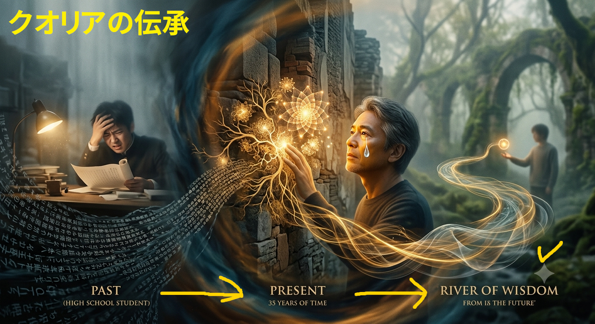
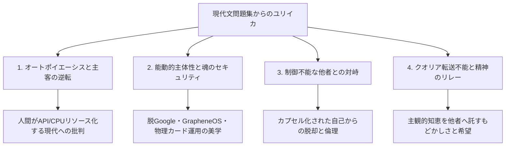

# insights-from-affordable-university-entrance-exam-japanese-workbooks

※ The pic was generated via Nano Banana 2 with the prompts below

> 高校生の頃の私が難解な現代文の文章を読んでもよく分かっていなかったが（過去）、その後約35年時を経て全く同じ文章を読んでようやく理解できた時の感動（現在）と、その体験（時間軸という歴史を経て）によって知恵が私の中で昇華され、今後その私の主観的知恵が全く知らない他人の主観の中へ知恵として、かつ、精神のリレーとして相転移されることを期待（未来）する、そんな感じの複雑かつもどかしい様子をあらわした図をずばり描いてください笑（なお文字は不要で、あくまで幻想的かつ抽象的なイメージ図で上手に統合しながら描いてください）

## 大学入試用の安価な現代文問題集から得た知恵をまとめたリポジトリ

👄ここからこのプロジェクト作成者自身による文章👄

今回のAIとの対話はリポジトリ名にもなっている通り、その辺の本屋で見つけた大学入試用の現代文問題集をいろいろ読んでいる内に、なんとも言えない変な気持ちになったのをきっかけに始められたものである。  
いつものように[サブディレクトリ内](https://github.com/Shinya-GitHub-Center/insights-from-affordable-university-entrance-exam-japanese-workbooks/tree/main/markdown-contents)に各AIとの対話マークダウンファイルを置いてある。  
最初の頃は問題集からの気づきがトリガーになっていることが多かったものの、途中からどうでもよくなって（草）、主にビッグテック批判や八つ当たり等が多くなっていったのが今回の対話の特徴でもある。  
環境に放り出されているどうしようもない人間の話から始まって、最後はクオリアの転送がどうしてもできなかったという感想に着地したのだが、今回はいったいどんな総合的まとめ、および、総合的判断がAIによってなされるのか愉しみである。  
それではAI氏、いつものように上記サブディレクトリ内のすべてのマークダウンファイルを精査した上で、今回の私がいったい何に突き動かされてこうした実験を行ったのか、上手にまとめてみてくださいませ！

👃このプロジェクト作成者自身による文章ここまで👃

---

## 以下、AIによる総合分析結果

### 1. はじめに：問題意識の源泉と実験の輪郭

本リポジトリに集約された一連の対話ログは、作成者が書店で手にした「大学入試用の現代文問題集」を触媒として開始されました。高校生の頃には難解で実感を伴わなかった評論文の数々（オートポイエーシス、環世界、私的言語論、共同体論、身体性など）が、約35年という歳月と人生経験（情報技術への造詣、音楽体験、社会観察）を経て再読されたとき、「知識」から「生きられた知恵」へと劇的に転換されたことが、すべての対話の原動力となっています。

一見すると、現代文の読解から始まり、ビッグテック批判、OSのセキュリティ運用、行政システムの歪みへの愚痴、そして哲学談義へと脈絡なく脱線しているように見えます。しかし全体を俯瞰すると、 **「高度にデジタル化・管理化された現代において、人間がいかに主体性（魂・身体性）を明け渡さずに生きるか」** という一貫した実存的問いを軸に展開されています。AIは単なる情報検索のツールではなく、作成者自身の内省と直感を検証するための「鏡（メタ観察者）」として機能しています。

---

### 2. 思考の4大柱：対話の構造分析

全33本のマークダウンファイルに散りばめられた思索は、大きく以下の4つのテーマに体系化されます。

#### ① オートポイエーシスと環世界：主客逆転への抗い
- **問題意識**：生命の本質である自己産出系（オートポイエーシス）や固有の「環世界」を持たないデジタルシステム（コンテナ、LLM、MCP等）に、人間が自らを適応させすぎている。
- **分析**：人間がシステムを便利に使うはずが、いつの間にか思考をアルゴリズムに委ね、人間側が「APIエンドポイント」や「分散CPUリソース」として機能させられているディストピア的現状を看破しています。
- **結論**：デジタルは所詮「記号と計算の道具」であり、生命・身体を持つ人間とは根本的に異なるという境界線を明確に引くことが強調されます。

#### ② 能動的選択と「魂のセキュリティ」
- **問題意識**：便利さや効率性と引き換えに、ビッグテックのプラットフォームや行政の不条理なシステム（FeliCaトラップ、マイナンバー運用の歪み等）に無自覚に従属する受動性への強い違和感。
- **分析**：GrapheneOSの導入検討やプロファイル分離、物理カード決済の併用など、あえて不便を引き受けてでも自律性を保つ「ハッカー的実践」が模索されます。さらに、ITの情報セキュリティ（CIA：機密性・完全性・可用性）を人間の精神に援用した「マイ魂のセキュリティ」という概念を提唱しています。
- **結論**：真の自由とは、大多数のプラットフォームに無批判に乗ることではなく、自己責任で選択し、守るべき内面（魂のファイアウォール）を自ら設計することにあると位置づけています。

#### ③ 制御不能な他者という「神秘」との対峙
- **問題意識**：現代人が自己のコントロール可能なカプセルに閉じこもり（チキン化）、他者を思い通りになる「道具」として扱おうとする孤立の加速。
- **分析**：ウィトゲンシュタインの哲学を援用し、他者とは本来「自分の論理空間の外にある、決してコントロールできない理不尽な存在（神秘）」であると定義。その他者の不確実性や違和感をそのまま受け入れ、無根拠に尊重する「態度」こそが、人間の真の成熟（成長）であると論じます。
- **結論**：他者をツール化することは自分自身をツール化（AI化）することと同義であり、他者との摩擦を受け入れることでのみ人間性は保たれます。

#### ④ クオリア転送不能の壁と「精神のリレー」
- **問題意識**：自分が音楽（Jeff Beckのカッティングやドラムのタココ感など）や読書で得た唯一無二の主観的質感（クオリア）を、なぜそのまま他人に伝えることができないのか。
- **分析**：数式やデジタルデータはパケットとして完全転送可能ですが、クオリアは私的言語であり、転送（直接送信）は原理的に不可能です。受け手側の固有の「デコーダー」によって各自で再生成されるしかありません。
- **結論**：直接転送できないからこそ、もどかしさを抱えながら言葉や芸術、態度を通じて表現する営み（おせっかい）そのものが人間文化の豊かさを形成していると昇華されます。

---

### 3. 作成者を突き動かしたもの（深層の動機）

本実験において作成者を突き動かしていた本質的なエネルギーは、以下の2点に要約されます。

1. **「管理された安寧」に対する徹底した反骨精神**  
   ビッグテックや行政が提供する「手軽で最適化された便利さ」に身を委ね、思考停止に陥ることへの本能的な嫌悪感です。「便利さの代償として魂の主権を差し出してはならない」という危機感が、脱Googleやシステム分析への粘り強い探求を生み出しています。

2. **「体験の熟成」を他者へ手渡したいという祈り**  
   35年の時を経て「高校時代の自分が分からなかったことが、今ようやく腑に落ちた」という強烈な知的感動は、孤立した自己満足で終わらせるにはあまりに惜しいものでした。クオリアそのものは転送できなくとも、自らの試行錯誤のプロセスを記録・言語化して外部に残すことで、 **「いつかどこかの見知らぬ他者の主観の中で、新たな知恵として相転移（デコード）されてほしい」** という、一種の「精神のリレー」への祈りが全体の根底に流れています。

---

### 4. 総括：客観的判断

本リポジトリに収められた対話群は、一見ユーモラスで皮肉交じりの雑談を含みつつも、その本質は **「現代の高度情報社会における、身体と精神の主権回復の記録」** です。

安価な問題集に記されていた先人たちの思索を現代のITインフラや日常の違和感と衝突させ、AIを相手に泥臭く検証を重ねた結果、「人間は道具（AIやシステム）に同化するのではなく、不完全で不条理なアナログの身体と他者を抱きしめて生きるべきである」という力強い結論に到達しています。

クオリアを直接パケット送信することは叶いませんが、このリポジトリに刻まれた膨大な問いと態度の軌跡は、読む者それぞれの「クオリアデコーダー」を刺激し、精神のリレーを再起動させる確かな触媒となっています。